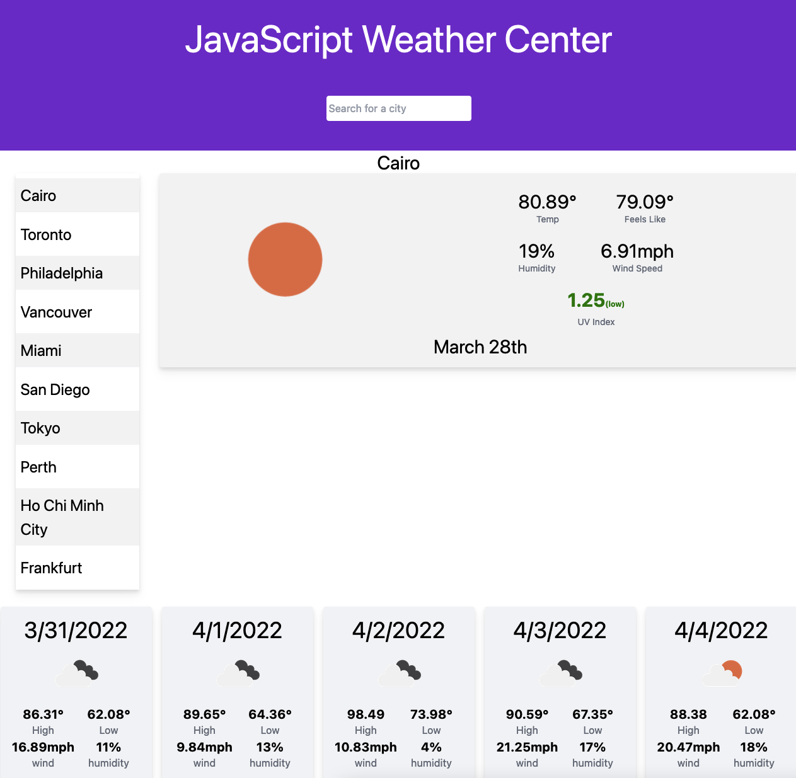

# Weather Dashboard

## Description

A simple yet effective weather dashboard to check the current and forecasted weather for any city a user chooses.

## Features

- Allows user to search for a city's current weather and five-day forecast.
- Persists the ten most recently searched cities in local in the browser.
- Displays a visual color-coded UV-Index to help users plan for dangerous UV conditions

## Usage

Try it out [here](https://mcarson24.github.io/weather_dashboard/).

## License

This project is open-sourced software and is licensed under the terms of the [MIT License](https://opensource.org/licenses/MIT).

